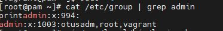
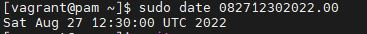
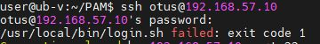
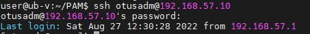

# Домашнее задание "PAM"


Для выполнения домашнего задания используйте методичку
https://docs.google.com/document/d/1lOFe3rv0QcnvOTNfQm0OMHbNQ0Cet6AR/edit?usp=share_link&ouid=104106368295333385634&rtpof=true&sd=true

Что нужно сделать?
1) Запретить всем пользователям, кроме группы admin логин в выходные (суббота и воскресенье), без учета праздников
\*) Дать конкретному пользователю права работать с докером и возможность рестартить докер сервис

### Запуск

```
vagrant up
```

### Файлы

1. Vagrantfile - настройка VM
2. login.sh - скрипт контроля работы по выходным кроме группы admin.

### Результаты

Проверка, что пользователи root, vagrant и otusadm есть в группе admin:



Меняем дату на выходной день



Соединение под пользователем otus



Под Пользователем otus войти не удалось, так как сегодня суббота.

Соединение под пользователем otusadm



Под пользователем otusadm войти удалось, так как он включен в группу admin.
